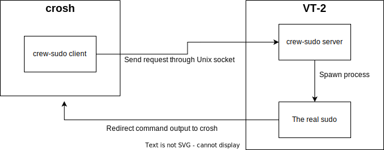

# crew-sudo
Make `sudo` "works" on ChromeOS `crosh` shell (ChromeOS v117+) by redirecting sudo calls to VT-2 shell

## Background
On ChromeOS v117, all Chrome-related processes (e.g. the ChromeOS UI) is executed with the `NO_NEW_PRIVS` bit, which means:
  - `suid/sgid`-bit is blocked, and thus no more `sudo`
  - This flag will be inherited by its subprocess (including `crosh`) and cannot be unset

That benefits security. However, it is bad for Crouton/Chromebrew users.

The official workaround for this is using the VT-2 shell (aka `frecon`) [^1], but `frecon` just sucks:
  - No clipboard support
  - No Caps Lock support
  - No HiDPI support
  - Poor compatibility with TUI programs

So does there a way to call `sudo` in `crosh` but run it in VT-2? That's what this project does :)

[^1]: `sudo` works in VT-2 because the VT-2 process is independent of the browser process and executed without the `NO_NEW_PRIVS` bit

## How it works?
It works in a similar way compared with popular Android root solutions like Magisk or SuperSU. It is divided into 2 parts:
  - A `sudo` server running in VT-2 for executing `sudo` requests from `crosh`
  - A `sudo` client for sending `sudo` requests to the server from `crosh`

All communication between the `sudo` server and client is done via Unix socket.



## Usage
```text
sudo <command to execute or sudo options>
---
crew-sudo [command] <options>
crew-sudo -h|--help
crew-sudo -V|--version
```

|Command       |Description|
|:-------------|:----------|
|`client`      |Run as client mode, pass all given command arguments to daemon|
|`daemon`      |Run as daemon mode, listen incoming requests at /tmp/crew-sudo.socket|
|`stop-daemon` |Stop currently running crew-sudo daemon|

|Options       |Description|
|:-------------|:----------|
|`--bashrc`    |Suppress "daemon is already running" error|
|`--foreground`|Run crew-sudo daemon in foreground|
|`--replace`   |Replace the currently running crew-sudo daemon|

## What works currently
- Send terminal input to command/send command output back to `crosh`
- Handle terminal size events
- Sync exit code
